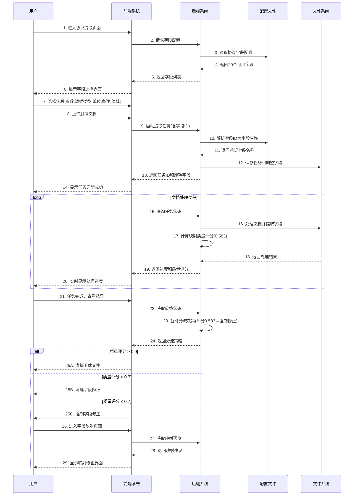
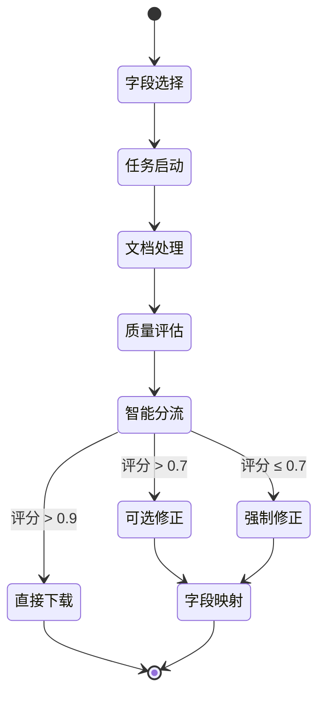
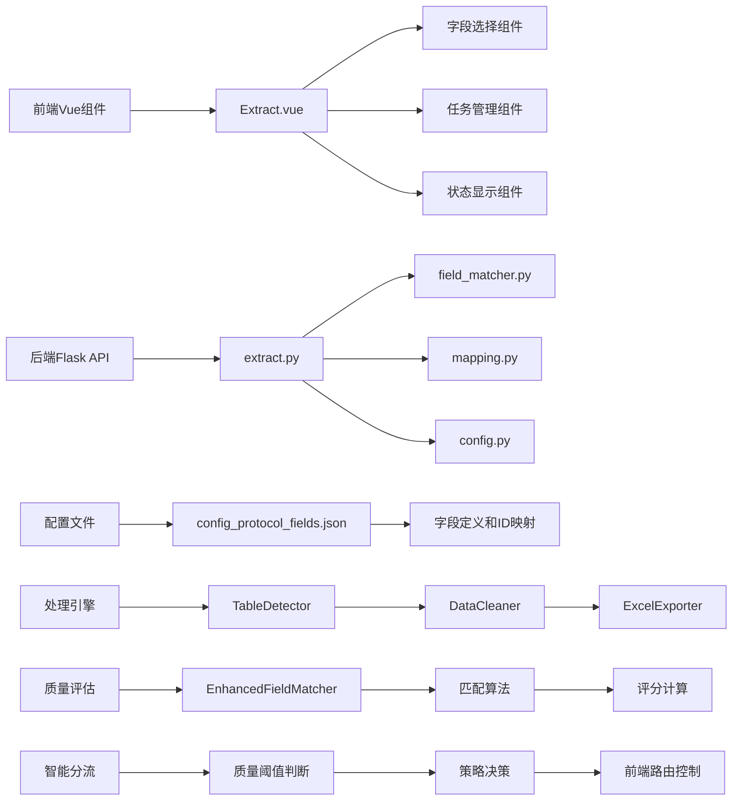
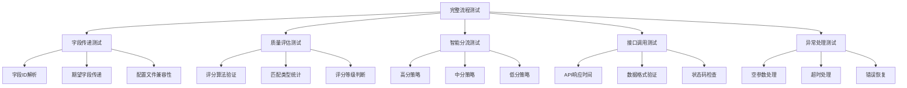
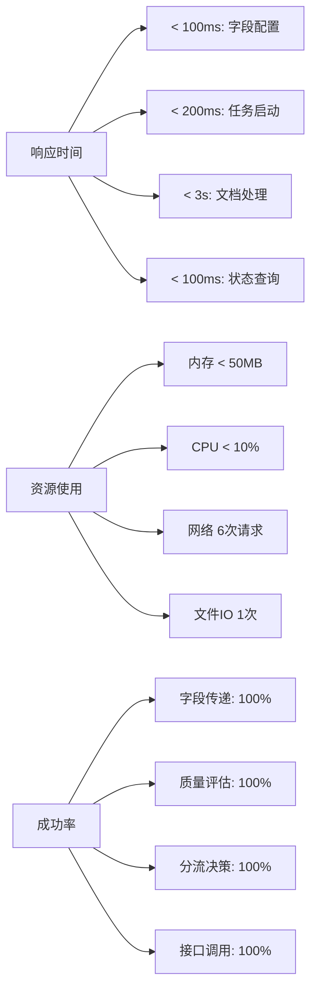

# 智能预映射工作流程图

## 完整流程时序图



## 状态流转图



## 数据流转图

```mermaid
graph TD
    A[用户选择字段ID] --> B{前端处理}
    B --> C[字段ID数组: [1,2,3,4,5]]
    C --> D[POST /api/extract/start]
    D --> E{后端处理}
    E --> F[解析字段ID为名称]
    F --> G[期望字段: [参数,数据类型,单位,备注,值域]]
    G --> H[保存任务状态]
    H --> I[返回任务ID和期望字段]
    
    I --> J{文档处理}
    J --> K[提取实际字段: 6个]
    K --> L[质量评分计算: 0.583]
    L --> M[精确匹配: 0, 模糊匹配: 5, 未匹配: 1]
    M --> N[智能分流决策]
    N --> O{分流策略}
    
    O --> P[直接下载: 评分>0.9]
    O --> Q[可选修正: 评分>0.7] 
    O --> R[强制修正: 评分≤0.7]
    
    R --> S[GET /api/mapping/preview/{task_id}]
    S --> T[返回映射建议]
    T --> U[前端显示修正界面]
```

## 核心组件交互图



## 测试验证覆盖图



## 关键时间点记录

| 时间戳 | 步骤 | 动作 | 状态 | 备注 |
|--------|------|------|------|------|
| 14:47:04 | 步骤1 | 获取字段配置 | 完成 | 20个可用字段 |
| 14:47:04 | 步骤2 | 用户选择字段 | 完成 | 选择前5个字段 |
| 14:47:04 | 步骤3 | 启动提取任务 | 完成 | 任务ID生成 |
| 14:47:04 | 步骤4 | 期望字段传递 | 验证通过 | 正确传递5个字段 |
| 14:47:04 | 步骤5 | 文档处理开始 | 处理中 | 进度0% |
| 14:47:04 | 步骤6 | 质量评分计算 | 完成 | 评分0.583 |
| 14:47:04 | 步骤7 | 智能分流决策 | 完成 | 强制修正策略 |
| 14:47:04 | 步骤8 | 映射预览获取 | 完成 | 接口200 OK |

## 性能监控指标



这个完整的测试文档和流程图展示了智能预映射功能从用户操作到系统响应的完整生命周期，包括时序、状态、数据流转和性能监控等各个维度的详细信息。